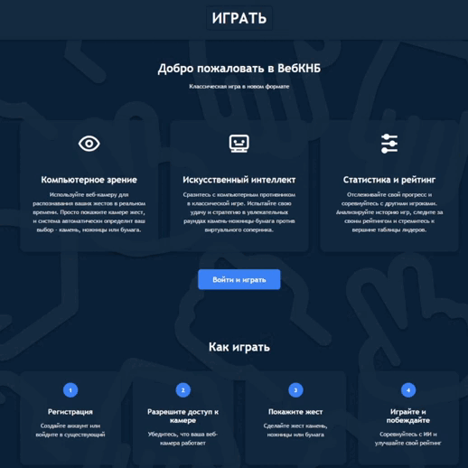
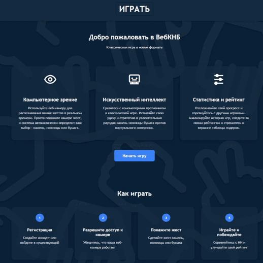

<div align="center" style="display: flex; flex-direction: row; align-items: center; justify-content: center; gap: 10px;">
                
</div>
<div align="center">
<h1>ВебКНБ (Web Rock Paper Scissors)</h1>
  


</div>
 
> 🏆 Этот проект был разработан в рамках хакатона DevHack #5 (26 февраля - 2 марта 2024) <br>
>  **[Презентация проекта](ВебКНБ.pptx)** 

>DevHack #5 - юбилейный хакатон для начинающих IT-специалистов в возрасте от 13 до 18 лет, проходивший в Центре цифрового образования детей «IT-Куб» (Ростов-на-Дону). Мероприятие организовано при поддержке ЮФУ, РГЭУ (РИНХ), РГУПС и Сбербанка.

## 🛠 Технологии

-  Python 3.8+
-  Django 5.1.6 
-  OpenCV
-  MediaPipe
-  HTML5
-  CSS3
-  JavaScript
-  Figma - [Концепт дизайна](https://www.figma.com/design/lCKHElk9uNNpPP2NIwRQRY/RPS?node-id=2-16&t=ZbWSBUOP4rnJ4vNp-1)

## 🚀 Установка и запуск

1. Клонируйте репозиторий:
```bash
git clone https://github.com/GigaGitCoder/web_knb.git
cd web_knb
```

2. Создайте виртуальное окружение и активируйте его:
```bash
python -m venv venv
source venv\Scripts\activate # Linux/MacOS
venv\Scripts\activate # Windows
```

3. Установите зависимости:
```bash
pip install -r requirements.txt
```

4. ⚠️ ВАЖНО ДЛЯ ОРГАНИЗАТОРОВ ХАКАТОНА:<br>
   Создайте файл `.env` в папке `web_knb` со следующим содержимым:
```
SECRET_KEY = 'django-insecure-a5!l+qxdu4k)keesvrm!5=ro0glbduk3#q5hqmk)3i_@7x7a2w'
```
   Примечание: Данный ключ оставлен в документации намеренно для упрощения процесса оценки проекта.

5. Примените миграции:
```bash
python manage.py migrate
```

6. Запустите сервер разработки:
```bash
python manage.py runserver
```

## 📝 Использование

1. Откройте браузер и перейдите по адресу `http://localhost:8000`
2. Зарегистрируйтесь или войдите в систему
3. Перейдите в раздел "Игра"
4. Разрешите доступ к камере
5. Покажите жест (камень/ножницы/бумага) перед камерой
6. Наслаждайтесь игрой!

## 🎮 Функционал

###  Система аккаунтов
<table>
<tr>
<td width="400px">

</td>
<td width="500px">
<div align="left" style="min-height: 200px;">
<b>Полноценная система авторизации и аутентификации пользователей с персональными профилями и статистикой.</b>
<hr style="border: 1px solid #555; margin: 10px 0;">
<ul>
  <li>Регистрация новых пользователей с уникальным логином и email</li>
  <li>Безопасное хранение паролей с использованием хеширования</li>
  <li>Авторизация существующих пользователей</li>
  <li>Персональная статистика игр для каждого пользователя</li>
</ul>
</div>
</td>
</tr>
</table>

###  Игровой процесс
<table>
<tr>
<td width="400px">

</td>
<td width="500px">
<div align="left" style="min-height: 200px;">
<b>Инновационный способ игры в "Камень-Ножницы-Бумага" с использованием компьютерного зрения для распознавания жестов.</b>
<hr style="border: 1px solid #555; margin: 10px 0;">
<ul>
  <li>Распознавание жестов через веб-камеру по истечению таймера</li>
  <li>Автоматическое определение жеста игрока (камень/ножницы/бумага)</li>
  <li>Случайный выбор жеста компьютером</li>
  <li>Мгновенное определение победителя</li>
  <li>Сохранение результатов в профиле игрока</li>
</ul>
</div>
</td>
</tr>
</table>

###  Таблица лидеров
<table>
<tr>
<td width="400px">

</td>
<td width="500px">
<div align="left" style="min-height: 200px;">
<b>Система рейтинга игроков, позволяющая отслеживать успехи и сравнивать результаты с другими участниками.</b>
<hr style="border: 1px solid #555; margin: 10px 0;">
<ul>
  <li>Отслеживание общей статистики всех игроков</li>
  <li>Рейтинг по количеству побед</li>
  <li>Отображение процента выигрышных партий</li>
  <li>Общее количество сыгранных игр</li>
</ul>
</div>
</td>
</tr>
</table>

## 👥 Команда разработчиков

<table>
  <tr>
    <td align="center" style="border: 1px solid #555;">
      <br />
      <b>Егор Холкин</b><br />
      <sub><i>Тимлид, Full-stack разработчик</i></sub>
      <hr style="border: 1px solid #555; margin: 10px 0;">
      <div align="left">
      <b>Вклад в проект:</b><br />
      • Backend/Frontend разработка<br />
      • Дизайн проекта<br />
      • Работа с базами данных<br />
      • Распознавание жестов
      <hr style="border: 1px solid #555; margin: 10px 0;">
      <b>Контакты:</b><br />
      <a href="https://github.com/GigaGitCoder">GitHub</a> • <a href="https://t.me/IgorXmel">Telegram</a>
      </div>
    </td>
    <td align="center" style="border: 1px solid #555;">
      <br />
      <b>Антон Михайличенко</b><br />
      <sub><i>Backend разработчик</i></sub>
      <hr style="border: 1px solid #555; margin: 10px 0;">
      <div align="left">
      <b>Вклад в проект:</b><br />
      • Backend разработка<br />
      • Работа с базами данных<br />
      • Распознавание жестов
      <hr style="border: 1px solid #555; margin: 10px 0;">
      <b>Контакты:</b><br />
      <a href="https://github.com/Anton2442">GitHub</a> • <a href="https://t.me/Kish242">Telegram</a>
      </div>
    </td>
    <td align="center" style="border: 1px solid #555;">
      <br />
      <b>Даниил Сапронов</b><br />
      <sub><i>Frontend разработчик</i></sub>
      <hr style="border: 1px solid #555; margin: 10px 0;">
      <div align="left">
      <b>Вклад в проект:</b><br />
      • Frontend разработка<br />
      • Концепт-арты<br />
      • UI/UX дизайн
      <hr style="border: 1px solid #555; margin: 10px 0;">
      <b>Контакты:</b><br />
      <a href="https://github.com/dencraz">GitHub</a> • <a href="https://t.me/dencraz">Telegram</a>
      </div>
    </td>
    <td align="center" style="border: 1px solid #555;">
      <br />
      <b>Роман Колесников</b><br />
      <sub><i>Frontend разработчик</i></sub>
      <hr style="border: 1px solid #555; margin: 10px 0;">
      <div align="left">
      <b>Вклад в проект:</b><br />
      • Frontend разработка<br />
      • Концепт-арты<br />
      • UI/UX дизайн
      <hr style="border: 1px solid #555; margin: 10px 0;">
      <b>Контакты:</b><br />
      <a href="https://github.com/Xqyat">GitHub</a> • <a href="https://t.me/Forliot">Telegram</a>
      </div>
    </td>
    <td align="center" style="border: 1px solid #555;">
      <br />
      <b>Цызов Владимир</b><br />
      <sub><i>Computer Vision разработчик</i></sub>
      <hr style="border: 1px solid #555; margin: 10px 0;">
      <div align="left">
      <b>Вклад в проект:</b><br />
      • Распознавание жестов<br />
      • Подготовка презентации
      <hr style="border: 1px solid #555; margin: 10px 0;">
      <b>Контакты:</b><br />
      <a href="https://github.com/Malanhei">GitHub</a> • <a href="https://t.me/malanhei">Telegram</a>
      </div>
    </td>
  </tr>
</table>

## 📄 Лицензия

MIT License - подробности в файле [LICENSE](LICENSE)
  
